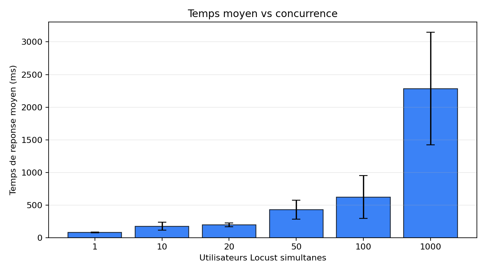
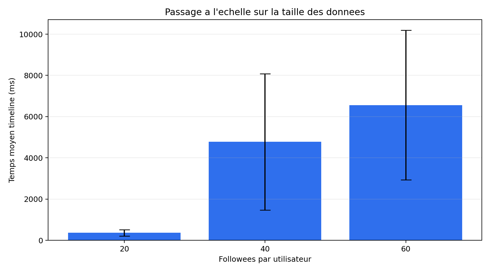

# Tiny Instagram (minimal) on Google App Engine

Fork de rendu: https://github.com/ThomasD8544/massive-gcp

Application déployée: https://projet-cloud-494614.ew.r.appspot.com

## Résultats du benchmark Locust

Les résultats demandés par le sujet sont disponibles dans le dossier `out/`:

- `out/conc.csv` et `out/conc.png` pour le passage à l'échelle sur la charge.
- `out/fanout.csv` et `out/fanout.png` pour le passage à l'échelle sur la taille des données.

Les mesures de charge ont été faites avec Locust en mode headless sur l'endpoint `GET /api/timeline`, avec 3 runs de 30 secondes par paramètre. Avant chaque expérience, les entités Datastore `User` et `Post` ont été supprimées puis le dataset demandé a été régénéré. Pour le fanout, les instances App Engine actives ont été supprimées entre les paramètres, mais pas entre les 3 runs d'un même paramètre.

### Démarche de mesure

L'application a été déployée sur Google App Engine à l'URL indiquée plus haut. Les mesures ont ensuite été faites depuis la machine locale avec Locust.

Pour chaque expérience, la base Datastore a été remise dans un état propre avec `clear_datastore.py`, qui supprime toutes les entités `Post` et `User`. Le dataset correspondant au paramètre testé a ensuite été régénéré: 1000 utilisateurs, un nombre fixe de posts par utilisateur, et un nombre de followees selon l'expérience. Cela évite qu'un test réutilise les données du test précédent.

Pour chaque valeur de paramètre, Locust a été lancé 3 fois en mode headless pendant 30 secondes. Le fichier `locustfile.py` crée des utilisateurs distincts: le premier utilisateur Locust appelle la timeline de `user1`, le deuxième celle de `user2`, etc. La colonne `AVG_TIME` vient de la ligne `Aggregated` produite par Locust. La colonne `FAILED` correspond au nombre d'échecs Locust observés pendant le run.

Le nombre d'instances a été mesuré avec `gcloud app instances list`, comme demandé dans le sujet. Pour le fanout, `NB_INSTANCES` correspond au maximum observé pendant le run Locust, afin d'éviter un instantané trop tardif ou trop tôt. Les instances ont été supprimées entre les paramètres `20`, `40` et `60`, afin de repartir d'un état comparable. Elles n'ont pas été supprimées entre les 3 runs d'un même paramètre, afin de mesurer le passage à l'échelle de l'application plutôt qu'un cold start répété à chaque run.

### Charge concurrente

Dataset fixe: 1000 utilisateurs, 50 posts par utilisateur, 20 followees random par utilisateur. Chaque paramètre est répété 3 fois.



Moyennes observées:

| Utilisateurs simultanés | Temps moyen |
| ---: | ---: |
| 1 | 78.26 ms |
| 10 | 174.12 ms |
| 20 | 196.92 ms |
| 50 | 429.30 ms |
| 100 | 621.84 ms |
| 1000 | 2284.85 ms |

Détails des runs:

| Utilisateurs simultanés | Run | AVG_TIME | FAILED | NB_INSTANCES |
| ---: | ---: | ---: | ---: | ---: |
| 1 | 1 | 85.79 ms | 0 | 0 |
| 1 | 2 | 72.49 ms | 0 | 1 |
| 1 | 3 | 76.50 ms | 0 | 1 |
| 10 | 1 | 258.68 ms | 0 | 2 |
| 10 | 2 | 145.89 ms | 0 | 4 |
| 10 | 3 | 117.80 ms | 0 | 4 |
| 20 | 1 | 234.70 ms | 0 | 4 |
| 20 | 2 | 190.15 ms | 0 | 7 |
| 20 | 3 | 165.91 ms | 0 | 6 |
| 50 | 1 | 557.36 ms | 0 | 4 |
| 50 | 2 | 507.65 ms | 0 | 7 |
| 50 | 3 | 222.88 ms | 0 | 12 |
| 100 | 1 | 1083.19 ms | 0 | 4 |
| 100 | 2 | 429.35 ms | 0 | 12 |
| 100 | 3 | 352.98 ms | 0 | 12 |
| 1000 | 1 | 3500.39 ms | 0 | 4 |
| 1000 | 2 | 1756.07 ms | 0 | 12 |
| 1000 | 3 | 1598.10 ms | 0 | 20 |

### Taille des données / fanout

Dataset fixe: 1000 utilisateurs, 100 posts par utilisateur, 50 utilisateurs simultanés. Le paramètre varie le nombre de followees par utilisateur. Les followees sont imbriqués: le cas 40 contient les 20 followees du cas 20 plus 20 autres, et le cas 60 contient les 40 followees du cas 40 plus 20 autres.



Moyennes observées:

| Followees par utilisateur | Temps moyen |
| ---: | ---: |
| 20 | 363.61 ms |
| 40 | 4776.62 ms |
| 60 | 6562.68 ms |

Détails des runs:

| Followees par utilisateur | Run | AVG_TIME | FAILED | NB_INSTANCES |
| ---: | ---: | ---: | ---: | ---: |
| 20 | 1 | 475.31 ms | 0 | 4 |
| 20 | 2 | 427.75 ms | 0 | 4 |
| 20 | 3 | 187.76 ms | 0 | 11 |
| 40 | 1 | 8590.99 ms | 0 | 6 |
| 40 | 2 | 2823.60 ms | 0 | 12 |
| 40 | 3 | 2915.28 ms | 0 | 12 |
| 60 | 1 | 10708.31 ms | 0 | 4 |
| 60 | 2 | 5005.32 ms | 0 | 8 |
| 60 | 3 | 3974.42 ms | 0 | 12 |

### Interprétation

#### Charge concurrente

Les résultats sont cohérents avec le comportement attendu d'une application déployée sur un gCloud autoscale comme Google App Engine. Quand la concurrence augmente de 1 à 100 utilisateurs simultanés, le temps moyen passe d'environ 78 ms à environ 622 ms. La latence augmente donc, mais elle reste inférieure à une seconde, et aucun run ne produit d'échec Locust. En parallèle, App Engine ajoute automatiquement des instances pour absorber la charge: on observe par exemple jusqu'à 12 instances sur les runs à 50 et 100 utilisateurs simultanés.

À 1000 utilisateurs simultanés, la latence augmente beaucoup plus fortement, avec un temps moyen d'environ 2,28 secondes. Cela s'explique par la saturation progressive de l'application et par le temps nécessaire à l'autoscaling pour allumer davantage d'instances. Le nombre d'instances monte jusqu'à 20, mais les requêtes peuvent être mises en attente pendant que ces instances deviennent disponibles. Locust a aussi signalé une utilisation CPU locale élevée sur ces gros runs, donc la machine qui injecte la charge peut influencer cette mesure. Le point important est que `FAILED` reste à 0: l'application ralentit, mais elle ne rejette pas les requêtes pendant ces tests.

Conclusion pour la charge: TinyInsta scale correctement sur une charge faible à moyenne grâce à l'autoscaling horizontal d'App Engine. À très forte concurrence, l'application continue de répondre, mais avec une latence beaucoup plus élevée.

#### Taille des données / fanout

Le test fanout montre une dégradation nette quand le nombre de followees augmente. Avec une charge fixe de 50 utilisateurs simultanés et 100 posts par utilisateur, la latence moyenne passe d'environ 364 ms pour 20 followees à environ 4,78 secondes pour 40 followees, puis 6,56 secondes pour 60 followees. L'augmentation n'est donc pas due à plus d'utilisateurs simultanés, mais bien à la taille du travail nécessaire pour reconstruire une timeline.

L'explication vient du modèle de lecture de TinyInsta. La timeline est construite à la demande, en lisant les posts des utilisateurs suivis. Le code essaie d'utiliser une requête `IN` sur le champ `author`, puis peut retomber sur plusieurs requêtes par auteur suivi avant de trier les posts par date. Plus un utilisateur suit de comptes, plus la lecture de timeline demande de scans et de fusion de résultats. App Engine peut ajouter des instances, mais cela ne supprime pas le coût de requête côté Datastore ni le coût de reconstruction de la timeline.

On observe justement que les instances montent pendant les runs fanout: jusqu'à 11 instances pour 20 followees, et jusqu'à 12 instances pour 40 et 60 followees. Malgré cela, la latence continue d'augmenter fortement. Cela montre que le goulet d'étranglement n'est pas seulement la couche applicative, mais aussi le modèle de données et la stratégie de lecture de timeline.

Conclusion pour le fanout: l'infrastructure essaie de scaler, mais l'architecture applicative ne scale pas correctement quand le nombre de followees augmente.

#### Conclusion générale

La réponse est donc nuancée. Sur le plan infrastructure, ça scale: Google App Engine joue bien son rôle en ajoutant automatiquement des instances, et les benchmarks ne montrent pas d'échecs Locust. Sur le plan applicatif et données, ça scale beaucoup moins bien: TinyInsta calcule les timelines à la lecture avec une approche de type pull, dont le coût augmente avec le nombre d'utilisateurs suivis.

Pour rendre TinyInsta plus scalable, il faudrait éviter de reconstruire toute la timeline à chaque lecture. Une solution classique serait de pré-calculer les timelines, par exemple avec une approche fanout-on-write: quand un utilisateur publie un post, le système pousse ce post dans une timeline pré-calculée pour ses followers. La lecture devient alors beaucoup plus rapide, car elle consiste surtout à lire une liste déjà préparée au lieu de faire une grosse requête `IN` à chaque consultation.

This repository contains a tiny Instagram-like demo implemented with Flask and Google Cloud Datastore (Firestore in Datastore mode). It is a small, educational project that demonstrates posting, following, and reading a simple timeline.

This README describes how to run, seed and test the app, plus notes about GQL queries and common deployment troubleshooting.

## Prerequisites
- Create a GCP Project:`https://console.cloud.google.com/`
  - See the prof.

- Open a cloud shell 
  - see the prof.

* Initialize or select your GCP project and create the App Engine application (if not already created):

```sh
gcloud init
gcloud app create
```

- clone the prof github repository : 
```
git clone https://github.com/momo54/massive-gcp
cd massive-gcp
```

* Install dependencies
```sh
pip install -r requirements.txt
```

* Deploy the app:

```sh
gcloud app deploy
```

* [OPTIONAL] Index does not matter:

```sh
gcloud app deploy index.yaml
# or
gcloud datastore indexes create index.yaml
```

* open the URL address of the you application, create account, post, follow. Does it Works?? If something is wrong where to find the error ?? 
  * See the prof


* How many servers are working for this app?? How much are you paying for running this app ? What is the cloud model for this app (Iaas, Paas, Saas). What is the Platform in PaaS ??

* See the impact in the datastore: do you see your data ?
  * See the prof

* How much are you paying for hosting these data in this store ?? 
* What is the consistency of this store ?
* What is the sharding strategy of this store ? How to be sure of that ? 
* What queries can you write with store (expressivity)

## HTTP Endpoints

- `/` — HTML UI for simple interactions
- `POST /login` — login with a username (no password)
- `POST /post` — create a new post (form)
- `POST /follow` — follow another user (form)
- `GET /api/timeline?user=<username>&limit=<n>` — JSON timeline for a user (default limit 20)
- `POST /admin/seed` — server-side seed (requires `SEED_TOKEN` via header `X-Seed-Token` or `token` param)

Example server-side seed call:

```sh
curl -X POST \
  -H "X-Seed-Token: change-me-seed-token" \
  "https://<YOUR_APP>.appspot.com/admin/seed?users=8&posts=100&follows_min=1&follows_max=4&prefix=load"
```

## Access the backend from the CLI

The JSON endpoint `GET /api/timeline?user=<username>&limit=20` is suitable for basic load experiments.

- Run locally against the dev server:

```sh
ab -n 200 -c 20 "http://127.0.0.1:8080/api/timeline?user=demo1&limit=20"
```

- Run against the deployed app (no cookie):

```sh
ab -n 500 -c 50 "https://<YOUR_APP>.appspot.com/api/timeline?user=demo1&limit=20"
```

- Optional: include a session cookie if you want to test authenticated flows (get `session` cookie from your browser devtools):

```sh
AB_COOKIE="session=<VALUE>"
ab -n 500 -c 50 -H "Cookie: $AB_COOKIE" "https://<YOUR_APP>.appspot.com/api/timeline?limit=20"
```

Interpreting common metrics:
- `Requests per second` — throughput
- `Time per request` — latency
- `Failed requests` — should remain near 0 for a healthy run

## GQL & Datastore notes

The timeline query used by the app is roughly:

```sql
SELECT * FROM Post WHERE author IN @authors ORDER BY created DESC
```

Notes:
- `IN` queries are conceptually implemented as a union of per-author scans followed by a k-way merge ordered by `created DESC`.
- The repository includes `index.yaml` with a composite index (author + created desc), which is required for efficient execution of the timeline query.
- Writes use the Datastore entity API; GQL is used for convenient reads only.

Limitations and trade-offs:
- `IN` with many values increases work and latency because it becomes multiple queries merged server-side.
- Global queries are eventually consistent; only key lookups and ancestor queries are strongly consistent. See `NOTES.md` for more detail.

## Troubleshooting: Cloud Build / staging bucket error

If you encounter an error like:

```
Failed to create cloud build: ... invalid bucket "staging.<PROJECT>.appspot.com"; service account ... does not have access
```

Check the following:

1. Required services are enabled:

```sh
gcloud services enable appengine.googleapis.com cloudbuild.googleapis.com iam.googleapis.com storage.googleapis.com
```

2. Ensure the App Engine service account has sufficient permissions on the staging bucket. For example, grant storage admin at project level (adjust to least privilege required):

```sh
PROJECT_ID="<YOUR_PROJECT>"
gcloud projects add-iam-policy-binding "$PROJECT_ID" \
  --member="serviceAccount:${PROJECT_ID}@appspot.gserviceaccount.com" \
  --role="roles/storage.admin"
```

3. If the staging bucket is missing, create it and grant the service account object admin on the bucket:

```sh
gsutil mb -p "$PROJECT_ID" -l europe-west1 "gs://staging.${PROJECT_ID}.appspot.com"
gsutil iam ch serviceAccount:${PROJECT_ID}@appspot.gserviceaccount.com:objectAdmin "gs://staging.${PROJECT_ID}.appspot.com"
```

Index deployment (if GCP prompts for missing indexes):

```sh
gcloud datastore indexes create index.yaml || gcloud app deploy index.yaml
```

## Notes on consistency, partitioning and CAP
See `NOTES.md` for a concise explanation of Datastore's partitioning (range partitioning with dynamic splits), replication, and its consistency model (generally AP for global queries; strong consistency for key lookups and ancestor queries).

## License
MIT

```
